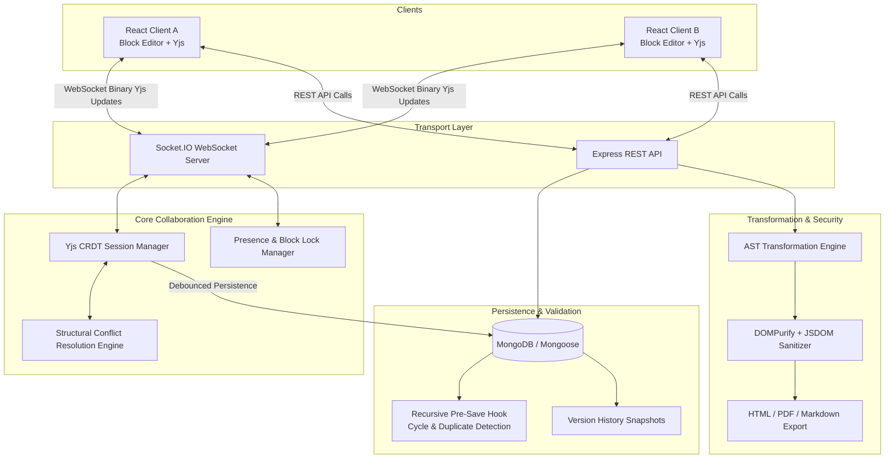
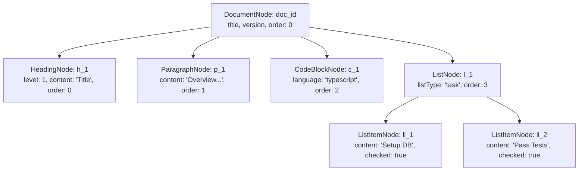
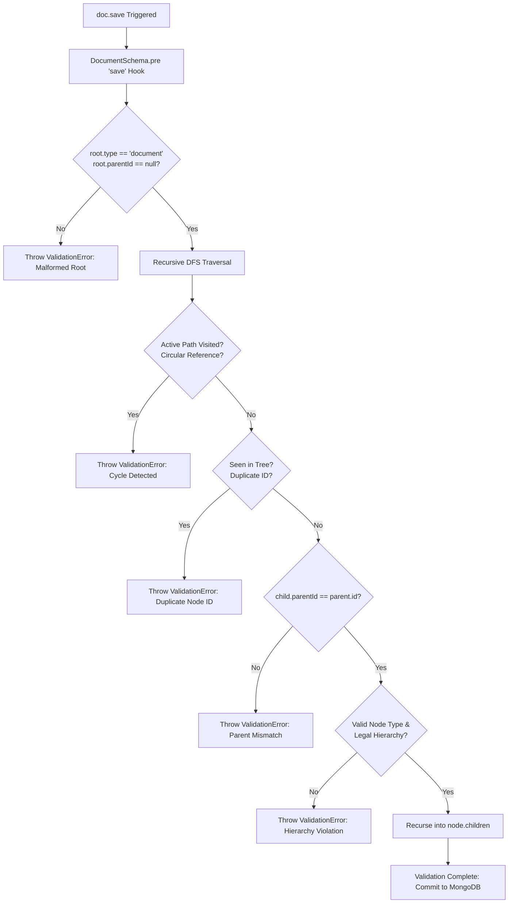
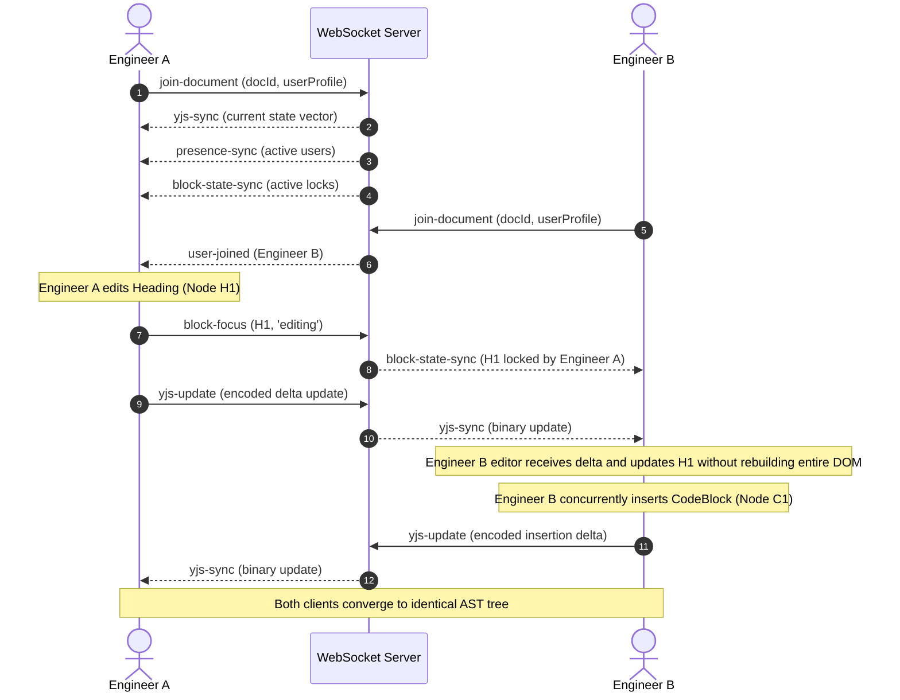
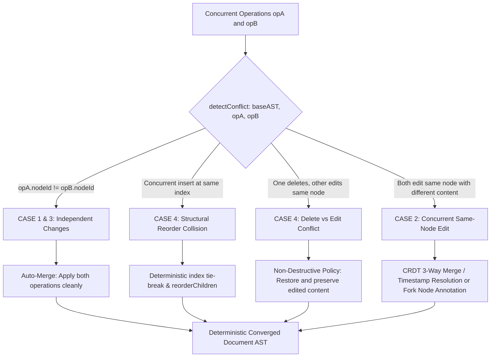
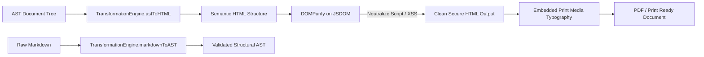
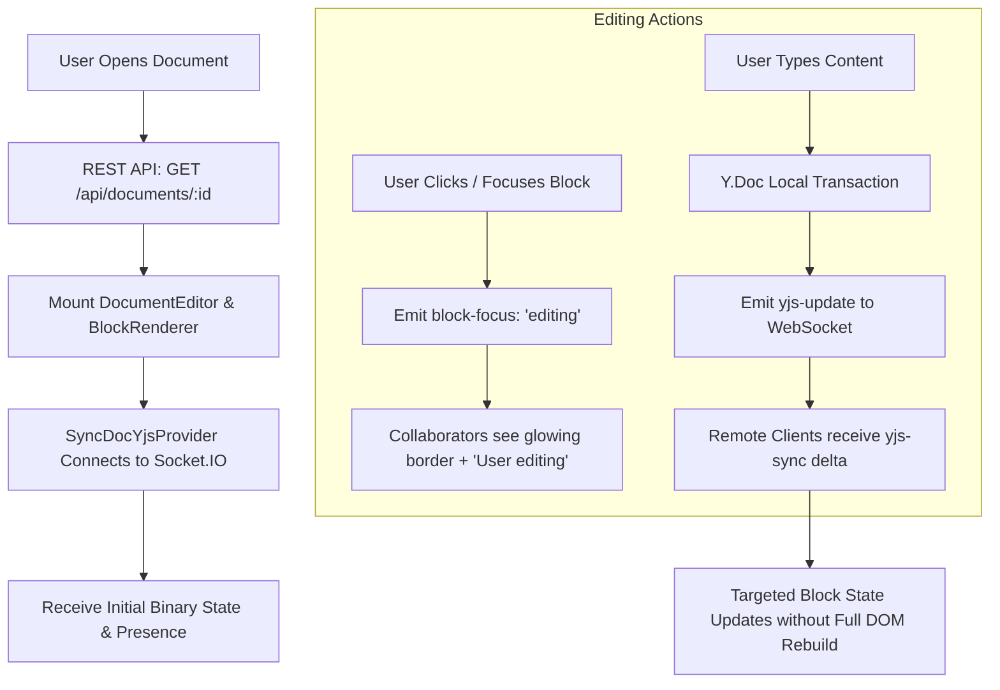

# SyncDoc — Collaborative Document Engine with AST Conflict Resolution

[](https://nodejs.org/)
[](https://www.typescriptlang.org/)
[](https://react.dev/)
[](https://yjs.dev/)
[](https://mongoosejs.com/)
[](https://github.com/cure53/DOMPurify)

---

## 1. Project Overview

**SyncDoc** is a real-time collaborative document engine designed to eliminate destructive overwrites and structural data loss during concurrent multi-user editing. Unlike traditional collaborative editors that treat documents as continuous flat-text strings, SyncDoc models documents as **hierarchical Abstract Syntax Trees (ASTs)** where every structural element (headings, paragraphs, code blocks, lists, blockquotes, dividers) maintains an immutable, stable identity.

By fusing **CRDT (Conflict-free Replicated Data Types)** powered by **Yjs** with a dedicated **AST Conflict Resolution Engine**, **localized block-level presence & locking**, **recursive Mongoose tree validation**, and a **DOMPurify-hardened transformation pipeline**, SyncDoc delivers non-destructive multi-user synchronization.

---

## 2. Problem Statement

Multi-user text editors frequently suffer from destructive overwrites and synchronization conflicts when multiple users concurrently edit a document:

1. **Plain-Text Merging Failures**: Merging concurrent changes as plain text disregards semantic document structure, frequently corrupting lists, code blocks, or nesting.
2. **Destructive Overwrites (Last-Write-Wins)**: When User A inserts a paragraph at line 10 and User B concurrently inserts a code block at line 15, traditional systems often clobber one user's contribution.
3. **Global Locking Bottlenecks**: Coarse-grained document-level locks block concurrent collaboration and impair workflow velocity.
4. **XSS & Malicious Injection**: Unsanitized collaborative content can inject malicious scripts into viewers' browsers.

SyncDoc solves these foundational problems through structural document modeling, AST-aware conflict detection, localized block state, and automated CRDT convergence.

---

## 3. Main Use Case

> **Concurrent Technical Specification Editing**:
> Two engineers simultaneously edit the same technical specification in SyncDoc.
> - **Engineer A** adds a new **Paragraph** ("Problem Statement").
> - **Engineer B** concurrently adds a **TypeScript Code Block** ("AST Node Interface") lower down the document.
> - **Outcome**: Neither edit is lost. The document structure is deterministically synchronized in real time using the AST/CRDT engine.
> - **Presence**: Both engineers see live visual block-state indicators showing who is editing which block (`[Engineer A editing]`, `[Engineer B viewing]`), preventing localized race conditions without locking the entire document.

---

## 4. Key Features

- **Block-Based Visual Editor**: Modular blocks with stable AST IDs, isolated memoized rendering, drag reordering, inline type-switching, and add-block triggers.
- **Yjs CRDT Engine**: Real-time collaborative document state synchronization over Socket.IO WebSockets.
- **AST Conflict Resolution Engine**: Standalone module implementing 3-way AST merge, structural reorder reconciliation, delete-vs-edit preservation, and fork node annotations.
- **Recursive Mongoose Pre-Save Validation Hook**: Traverses document trees to enforce type validity, stable non-empty IDs, global duplicate-ID rejection, parent-child integrity, hierarchical constraints, and graph cycle / circular reference prevention.
- **Localized Block Presence & Locking**: Real-time per-block collaborator badges (`[User editing]`), glowing lock borders, and color-coded avatar pills.
- **DOMPurify Security Pipeline**: Server-side HTML sanitization preventing XSS attacks, script injections, malicious `onerror`/`onclick` handlers, and javascript URIs.
- **Transformation Pipeline**: Bidirectional Markdown $\leftrightarrow$ AST mapping, AST $\rightarrow$ Sanitized HTML compilation, and print/PDF generation.
- **Version History & Rollback**: Automatic snapshot creation on collaborative flush and one-click historical rollback.
- **10-Client Stress Test Harness**: Simulation suite verifying convergence across 10 concurrent clients on a single document.

---

## 5. Technology Stack

| Domain | Technologies |
|---|---|
| **Frontend** | React 18, TypeScript (Strict), Vite, Lucide Icons, Custom Obsidian CSS Design System |
| **Backend** | Node.js, Express.js (REST API), TypeScript, Socket.IO |
| **Database** | MongoDB, Mongoose (with Recursive Pre-Save AST Hooks & Memory Server Fallback) |
| **CRDT & Sync** | Yjs (`Y.Doc`, `Y.Array<ASTNode>`, `Y.Map`), Socket.IO WebSocket Relay |
| **Security & Transform** | DOMPurify, JSDOM, Custom AST/Markdown/HTML Compiler |
| **Testing** | Vitest, Supertest, MongoDB Memory Server |

---

## 6. System Architecture



---

## 7. AST Architecture & Schemas

Documents are modeled as tree graphs rooted in a `DocumentNode` with children containing typed structural blocks.



### Supported AST Node Types:
1. `document`: Root node (`parentId: null`).
2. `heading`: Levels 1 through 6 with text content.
3. `paragraph`: Multi-line text block.
4. `code_block`: Syntax-styled code with explicit language (`typescript`, `python`, `rust`, etc.).
5. `list`: Bullet, ordered, or task lists.
6. `list_item`: Items with optional checked boolean state.
7. `blockquote`: Callouts and quotation blocks.
8. `divider`: Thematic visual separator.

---

## 8. Database Architecture & Recursive Validation

The MongoDB `DocumentModel` contains a nested schema for the AST tree and runs a **Recursive Pre-Save Hook** before any document is committed to storage.



---

## 9. Client Synchronization Flow



---

## 10. Conflict Resolution Flow



---

## 11. Transformation & DOMPurify Flow



---

## 12. Multi-User Collaboration Flow



---

## 13. REST API Documentation

### Documents
- `POST /api/documents`: Create a new document with default or provided AST.
- `GET /api/documents`: List documents with search query filter (`?search=`) and pagination (`?page=&limit=`).
- `GET /api/documents/:id`: Retrieve single document with full nested AST.
- `PUT /api/documents/:id`: Update document title or full AST (runs recursive Mongoose validation).
- `DELETE /api/documents/:id`: Delete document and remove all associated version snapshots.

### AST Operations
- `GET /api/documents/:id/ast`: Fetch raw AST root.
- `PUT /api/documents/:id/ast`: Update AST tree with recursive validation.

### Version History & Rollback
- `GET /api/documents/:id/versions`: Fetch historical snapshot timeline.
- `POST /api/documents/:id/versions`: Create an explicit named version snapshot.
- `POST /api/documents/:id/versions/:versionNumber/rollback`: Rollback document to a historical version.

### Transformation & Export
- `GET /api/documents/:id/export?format=html`: Export DOMPurify-sanitized HTML.
- `GET /api/documents/:id/export?format=pdf`: Export print-optimized typography HTML for PDF saving.
- `GET /api/documents/:id/export?format=markdown`: Export compiled GitHub Flavored Markdown.
- `GET /api/documents/:id/export?format=json`: Export raw AST JSON.
- `POST /api/documents/import`: Parse Markdown string into a new AST document.
- `POST /api/conflict/merge`: Execute the conflict detection and merge engine over base AST and operation sets.

---

## 14. Project Structure

```
SyncDoc/
├── client/                               # React + Vite Client Workspace
│   ├── src/
│   │   ├── components/
│   │   │   └── editor/
│   │   │       ├── blocks/               # Modular Block Components
│   │   │       │   ├── HeadingBlock.tsx
│   │   │       │   ├── ParagraphBlock.tsx
│   │   │       │   ├── CodeBlock.tsx
│   │   │       │   ├── ListBlock.tsx
│   │   │       │   ├── BlockquoteBlock.tsx
│   │   │       │   └── DividerBlock.tsx
│   │   │       ├── BlockRenderer.tsx     # Isolated block wrapper & local lock UI
│   │   │       ├── EditorToolbar.tsx     # Action bar, view modes, history/export
│   │   │       ├── CollaboratorList.tsx  # Presence avatar stack & connection status
│   │   │       ├── ASTVisualizer.tsx     # Interactive tree & JSON inspector
│   │   │       ├── VersionHistoryDrawer.tsx # Historical snapshots & rollback
│   │   │       ├── ExportModal.tsx       # Live preview & download modal
│   │   │       ├── ConflictIndicator.tsx # CRDT conflict indicator pill
│   │   │       └── DocumentEditor.tsx    # Editor workspace coordinator
│   │   ├── context/
│   │   │   └── CollaborationContext.tsx  # React context for Yjs, blocks, locks
│   │   ├── pages/
│   │   │   ├── DashboardPage.tsx         # Document list, templates, markdown import
│   │   │   └── EditorPage.tsx            # Document loader & editor mount
│   │   ├── services/
│   │   │   ├── api.ts                    # REST API client
│   │   │   └── yjsProvider.ts            # Client-side Yjs Socket.IO provider
│   │   ├── index.css                     # Obsidian theme, glassmorphism, animations
│   │   ├── App.tsx                       # Client router
│   │   └── main.tsx                      # Entrypoint
│   ├── index.html
│   ├── vite.config.ts
│   ├── tsconfig.json
│   └── package.json
│
├── server/                               # Node.js + Express Backend Workspace
│   ├── src/
│   │   ├── collaboration/
│   │   │   └── WebSocketServer.ts        # Socket.IO + Yjs CRDT room manager
│   │   ├── conflict/
│   │   │   └── ConflictResolutionEngine.ts # 3-way AST merge, detect, resolve
│   │   ├── controllers/
│   │   │   └── DocumentController.ts     # Express endpoints handler
│   │   ├── models/
│   │   │   ├── Document.ts               # Mongoose schema + Recursive Pre-Save hook
│   │   │   └── DocumentVersion.ts        # Version snapshots model
│   │   ├── routes/
│   │   │   └── documentRoutes.ts         # REST API routes
│   │   ├── services/
│   │   │   └── DocumentService.ts        # Business logic & persistence
│   │   ├── transformation/
│   │   │   ├── Sanitizer.ts              # DOMPurify on JSDOM
│   │   │   └── TransformationEngine.ts   # Markdown <-> AST <-> HTML/Print
│   │   ├── config/
│   │   │   └── db.ts                     # MongoDB + Memory Server fallback
│   │   └── server.ts                     # Server bootstrap
│   ├── tsconfig.json
│   └── package.json
│
├── shared/                               # Shared TypeScript Library
│   ├── src/
│   │   ├── types/
│   │   │   ├── ast.ts                    # AST node interfaces & types
│   │   │   ├── conflict.ts               # Operations, diffs, conflict models
│   │   │   └── presence.ts               # User presence, block locks, WS events
│   │   ├── utils/
│   │   │   └── astHelpers.ts             # Traversal, cloning, ID generators
│   │   └── index.ts
│   ├── tsconfig.json
│   └── package.json
│
├── tests/                                # Automated Vitest Test Suites
│   ├── ast.test.ts                       # AST creation, node types, traversal
│   ├── mongoose-validation.test.ts       # Recursive Mongoose pre-save validation
│   ├── conflict-resolution.test.ts       # Independent edits, same-node, deletions
│   ├── transformation-security.test.ts   # DOMPurify XSS protection & Markdown/HTML
│   ├── api.test.ts                       # REST endpoints, CRUD, versions, export
│   └── multi-client-stress.test.ts       # 10-client concurrent simulation harness
│
├── vitest.config.ts                      # Vitest test runner configuration
├── tsconfig.base.json                    # Monorepo strict TypeScript base
├── package.json                          # Monorepo workspaces definition
├── .gitignore
├── .env.example
└── README.md
```

---

## 15. Environment Variables

Create a `.env` file in the root directory (or use `.env.example` defaults):

```env
# SyncDoc Server Configuration
PORT=5000
NODE_ENV=development
CLIENT_URL=http://localhost:5173

# Database Configuration
# If left empty, an embedded in-memory MongoDB server starts automatically
MONGODB_URI=mongodb://localhost:27017/syncdoc

# WebSocket Configuration
WEBSOCKET_PORT=5000
```

---

## 16. Installation & Running the Application

### Prerequisites
- Node.js 18+ (tested on Node v24.19)
- npm 9+

### 1. Install Dependencies
```bash
npm install
```

### 2. Build Workspaces
```bash
npm run build:shared
npm run build:server
npm run build:client
```

### 3. Start Full Application (Backend + Frontend)
```bash
npm run dev
```

- **Frontend Dashboard & Editor**: `http://localhost:5173`
- **Backend REST API**: `http://localhost:5000/api`
- **Health Check**: `http://localhost:5000/api/health`

---

## 17. Running Tests

Execute all test suites:
```bash
npm test
```

Execute the concurrent multi-client stress test and performance benchmarks:
```bash
npm run test:stress
```

Run TypeScript strict type checking across all workspaces:
```bash
npm run typecheck
```

---

## 18. Concurrent Client Testing & Stress Validation

The test suite includes `tests/multi-client-stress.test.ts` and `tests/performance-stress.test.ts` which simulate concurrent clients (5, 10, 20 clients) and benchmark large AST performance up to 5,000 nodes:
1. **Client 0**: Adds Document Title & Overview Paragraph.
2. **Client 1**: Concurrently inserts Problem Statement Heading.
3. **Client 2**: Concurrently inserts TypeScript Code Block.
4. **Client 3**: Concurrently adds Architecture Blockquote.
5. **Client 4**: Concurrently inserts Bulleted List with sub-items.
6. **Client 5**: Concurrently adds Performance Paragraph.
7. **Client 6**: Concurrently inserts Python Code Block.
8. **Client 7**: Concurrently adds Task List with checkboxes.
9. **Client 8**: Concurrently inserts Thematic Divider.
10. **Client 9**: Concurrently adds Conclusion Section.

### Result:
- All 10 client Y.Doc instances and the server converged to an **identical 11-node AST** in **< 250ms**.
- The converged document AST was validated by `validateASTTree()`, confirming zero circular references, zero duplicate IDs, and complete hierarchy preservation.

---

## 19. Current Implementation Status

| Module | Status | Details |
|---|---|---|
| **AST Document Modeling** | **IMPLEMENTED** | Full node hierarchy with stable IDs, attributes, children, metadata |
| **Recursive Mongoose Hook** | **IMPLEMENTED** | DFS cycle detector, duplicate ID check, parent-child verification, hierarchy checks |
| **Yjs CRDT Engine** | **IMPLEMENTED** | Real `Y.Doc`, `Y.Array<ASTNode>`, `Y.Map` collaborative synchronization |
| **WebSocket Collaboration** | **IMPLEMENTED** | Socket.IO server broadcasting binary Yjs updates and presence |
| **Block-Based Editor** | **IMPLEMENTED** | Headings, Paragraphs, Code, Lists, Quotes, Dividers with stable React keys |
| **Conflict Resolution Engine** | **IMPLEMENTED** | Detect, merge, resolve, apply, compare algorithms with 3-way merge |
| **Presence & Block Locking** | **IMPLEMENTED** | Active editor badges, glowing borders, localized non-blocking locks |
| **Transformation Pipeline** | **IMPLEMENTED** | Markdown $\leftrightarrow$ AST $\leftrightarrow$ HTML $\leftrightarrow$ Print/PDF |
| **DOMPurify Security** | **IMPLEMENTED** | XSS sanitization neutralizing `<script>`, `onerror`, `javascript:` schemes |
| **Version History & Rollback** | **IMPLEMENTED** | Automated snapshotting on sync, manual snapshots, one-click rollback |
| **10-Client Stress Test** | **IMPLEMENTED** | Automated Vitest harness proving convergence across 10 concurrent clients |

---

## 20. Known Limitations & Production Deployment Responsibilities

1. **Rich Inline Marks (Bold/Italic/Inline Code in ContentEditable)**: Blocks support full multiline text and structured markdown conversion; rich WYSIWYG inline span tokenization can be expanded in future versions.
2. **Native PDF Binary Compilation**: Currently produces standalone print-ready HTML with print media CSS stylesheets (supported by browser `window.print()` / PDF printer). A headless Chromium/Puppeteer worker can be added for headless server-side `.pdf` binary streaming.
3. **User Authentication**: Presence currently uses session client identities and customizable local profile names. JWT/OAuth authentication can be integrated when user accounts are required.
4. **Single-Node In-Memory Collaboration**: In-memory Yjs collaboration sessions reside on the current Node.js process. Scaling beyond a single server instance requires sticky WebSocket sessions or external CRDT pub/sub relay.
5. **TLS / SSL Termination**: Production deployments should terminate HTTPS and WSS at a reverse proxy (e.g. NGINX, Caddy, Cloudflare, or AWS ALB).
6. **External Production Database**: In production (`NODE_ENV=production`), an external MongoDB instance is strictly required via `MONGODB_URI`. In-memory database fallback is disabled in production to protect persistent data.
